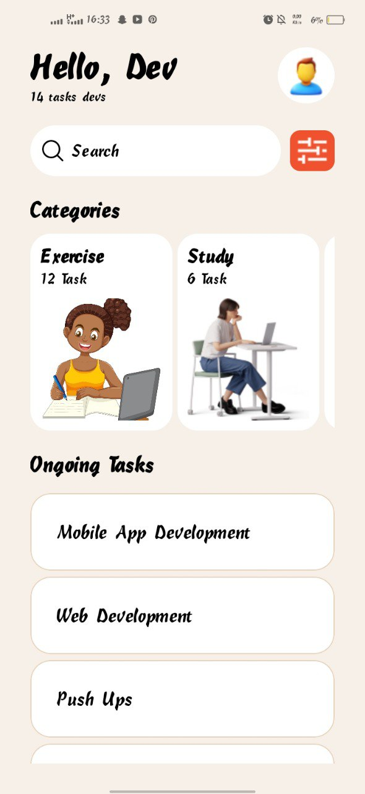
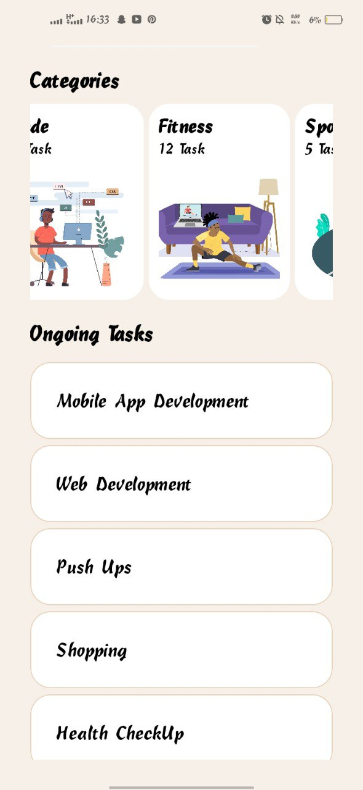

## Task Manager App

This Task Manager App allows users to organize their tasks into different categories and keep track of ongoing tasks.  The app is designed to closely match the provided UI design.

### Screenshots

### Components Usage

- **View**: Used to structure and layout content within the app.
- **Text**: Display text content to the user.
- **ScrollView**: Enables scrolling of content when it exceeds the screen size.
- **TextInput**: Allows users to input text data.
- **Stylesheet**: Used to define styles for components.
- **Button**: Provides a clickable button for user interaction.
- **FlatList or SectionList**: Renders lists of tasks in a scrollable format.
- **Image**: Displays icons and images within the app.

### Categories

1. Exercise
2. Study
3. Code
4. Fitness
5. Leisure
6. Sports
7. Cook
8. Planning

### Ongoing Tasks

1. Mobile App Development
2. Web Development
3. Push Ups
4. Shopping
5. Health CheckUp
6. Fitness
7. Journaling
8. Travelling Planning
9. Pet Care
10. Car Maintenace
11. Expense Tracking
12. Sleep tracker
13. Organize closet
14. Pay bills
15. Call mom

### Running the App

To run the app locally, follow these steps:

1. Clone the repository to your local machine.
git clone https://github.com/qpheal/rn-assignment3-11293905.git
2. Navigate to the project directory.
3. Run `npm install` to install dependencies.
4. Run `npm run start` to start the development server.
5. Open the app on your device or emulator.

